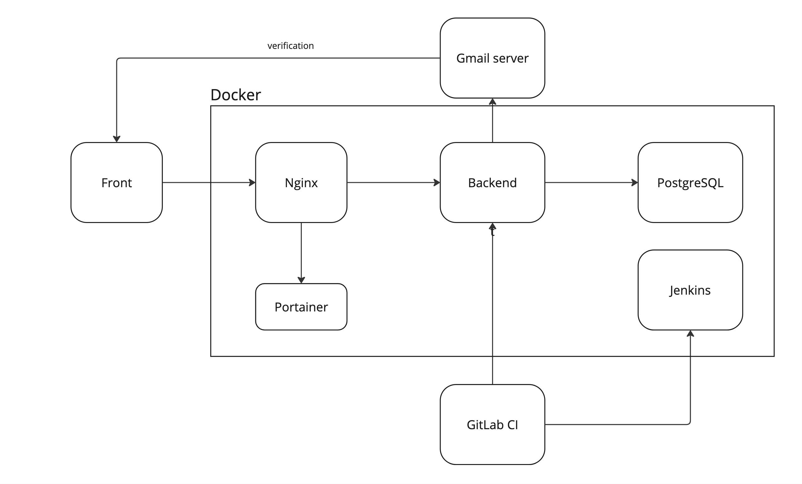

<h1>Трекер задач IMA</h1>


<b>IMA - это трекер задач, позволяющий управлять проектами и задачами. Сервис имеет весь функционал, чтобы команда могла начать его использовать для улучшения процессов разработки и внедрения продуктов.</b>

## Роадмап развития сервиса

- [x] Управление проектами
- [x] Управление задачами
  - статусы
  - описание
  - приоритет
  - дата окончания
- [x] Добавление участников в проект
  - просмотр своих проектов
- [x] Получение уведомлений по почте
  - [x] о регистрации
  - [ ] об изменении задач


## Технологии


## Архитектура сервиса


## Инфраструктура проекта

<a href="https://logotipiwe.ru/ima/swagger-ui"><b>Production swagger</b></a>

<a href="https://github.com/Baranovskiydev/ima-front"><b>Фронтенд репозиторий</b></a>

<a href="https://logotipiwe.ru:30134"><b>Мониторинг контейнеров</b></a>

<a href="http://logotipiwe.ru:30136/"><b>Серверный Jenkins</b></a>

## Техническая документация

### Запуск проекта

Предварительно необходимо скопировать в папки с соответствующими docker-compose конфигами .env файлы с нужной конфигурацией.

```
export IMAGE=...
docker build -t ${IMAGE}
docker push ${IMAGE}

docker compose -f ./deploy/ingress.yml up -d
docker compose -f ./deploy/jenkins.yml up -d
docker compose -f ./deploy/pg.yml up -d
docker compose -f ./deploy/pgadmin.yml up -d
docker compose -f ./deploy/portainer.yml up -d

docker compose up -d
```